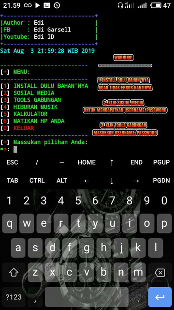

Cara download script melalui Termux
dan instalnya cukup langsung saja
buka Aplikasi Termux
jika Aplikasi termux sudah Terbuka
selanjutnya ketikan perintah seperti
Hal di bawah ini:

```
$ pkg update && pkg upgrade
$ pkg install git
$ pkg install python2
$ termux-setup-storage
$ cd storage
$ cd downloads
$ git clone https://github.com/MEiZU-M5/all.git
$ cd all
$ python2 tools.py
```

# NOTE :
jika ada kata - kata [y/n] ketik y lalu Enter,
selamat Mencoba!

# Gambar Screnshoot


# POLLOW FACEBOOK:
👉 https://www.facebook.com/edi.garsella

# Jangan Lupa Subcribe Video Channel Kami:
👉 https://www.youtube.com/channel/UCr1X7uS9_FEjITKDah2FxXw
